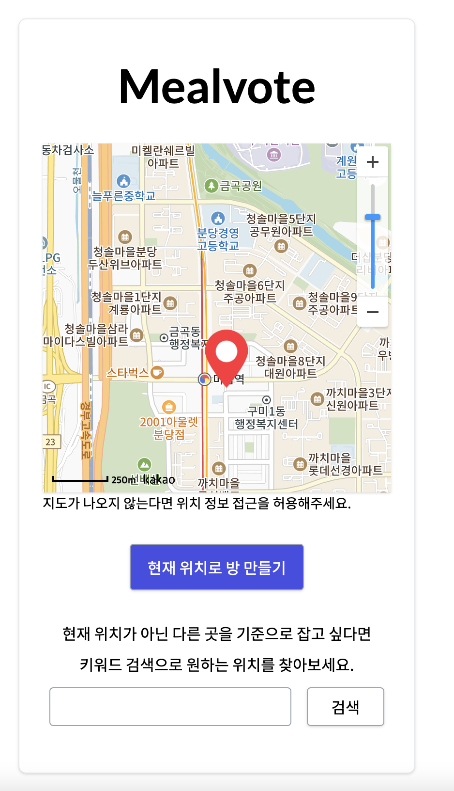

# Mealvote
여러 사람이서 식사를 할 때 갈 식당을 투표를 통해 정하는 웹 사이트

<a href="https://mealvote.net">mealvote.net</a>

## 사용 기술과 주요 관심사
- Node.js, express, sequelize, MySQL
- React, tailwindcss, axios
- express-session으로 사용자 각각을 구별하고, socket.io를 통하여 실시간 채팅과 투표 구현하기
- 카카오맵 지도 API의 지도 불러오기와 키워드 검색 등을 활용
- HTML geolocation API ( 크롬에서는 HTTPS 환경에서만 geolocation 사용이 가능하여 HTTPS 인증서를 발급받음 )
- AWS EC2로 배포, https 적용

## 기능과 화면

- 주의 : HTML geolocation API가 제대로 작동하기 위해서 위치 정보 사용 허용이 필요하다. 
  지도가 안 뜬 상태에서 '현재 위치로 방 만들기' 누르면 기본 위치인 강남역을 기준으로 방이 생성된다.
  

### 메인 화면

- 식사 메뉴 투표방의 기준 위치를 정하는 페이지. '현재 위치로 방 만들기'를 통해서 방을 생성할 수 있다.
- 방을 생성한 사람(세션)은 그 방의 방장이 되어, 투표 시작과 종료를 할 수 있다.
- 다른 위치를 기준으로 방을 생성하고 싶다면, 원하는 장소명을 검색하여 지도에서 해당 위치를 클릭하면 기준 위치가 된다.

### 투표 중 화면

- 방장이 방을 생성하면 위 화면으로 리다이렉트된다.
- 지도, 검색 반경 슬라이더 및 버튼, 채팅창, 주변 식당 키워드 검색창, 그리고 투표 후보창이 있다.
- '채팅창 주소 복사하기' 버튼을 클릭하면 클립 보드에 해당 방의 URL이 복사된다. 이를 다른 사람에게 공유하여 방으로 초대할 수 있다.
- '주변 식당 키워드로 검색'을 통해서 주변 음식점들을 키워드로 검색할 수 있다. 검색 반경은 슬라이더를 통해서 조절할 수 있다.
  키워드를 검색하면 지도에 검색된 식당들이 마커로 표시된다.

    
  

- 각 식당 소개에 나와있는 카카오맵 버튼을 통해서 해당 식당의 카카오맵 페이지를 띄울 수 있다.
- '투표 후보로 넣기' 버튼을 통해 투표 후보로 해당 식당을 추가할 수 있다.
- 방장은 투표 후보가 2곳 이상일 때 투표를 시작할 수 있고, 총 투표 수가 2표 이상일 때 투표를 종료할 수 있다. 투표 시작과 종료는 채팅창으로 공지가 된다.

### 투표 결과 화면

## ERD

